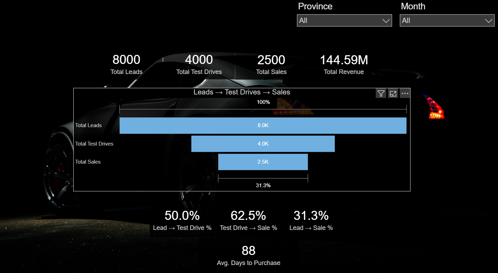
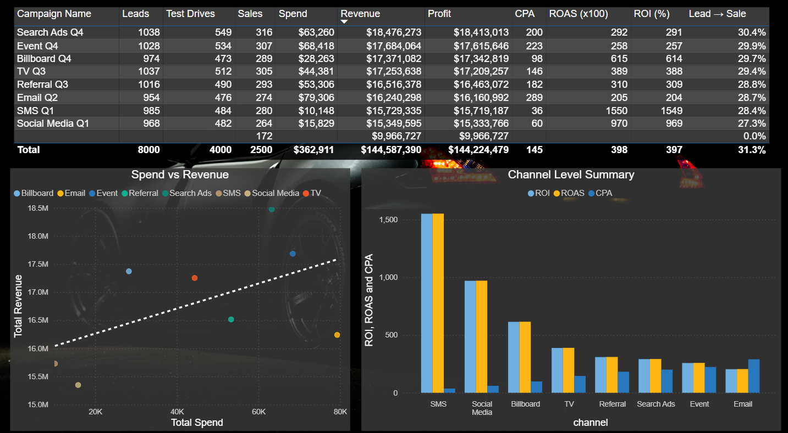
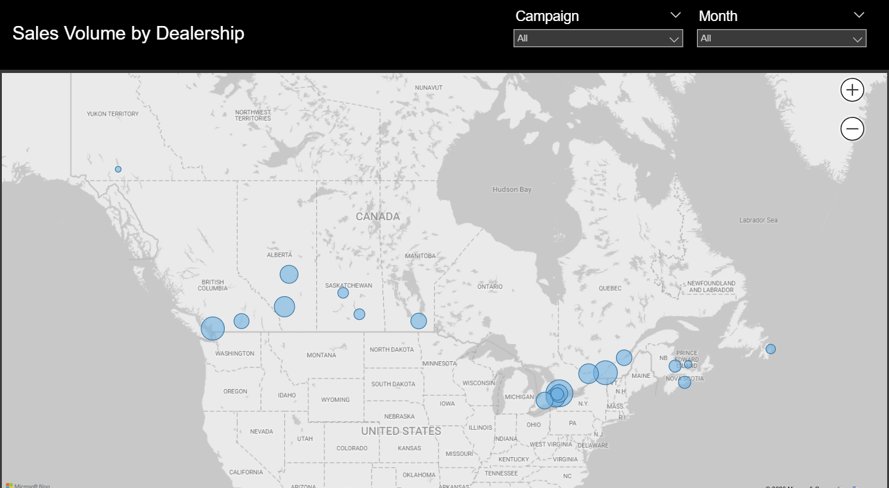

# Automotive Sales Funnel Analytics
A full analytics project investigating marketing campaign performance across the automotive sales funnel, from lead to final purchase. This five-page dashboard was built using SQL and Power BI to assess attribution sensitivity, conversion behaviour, and financial performance metrics.

### Dashboard walkthrough
A short video walkthrough explaining the dashboard structure, key metrics and insights 
[Watch on Loom](https://www.loom.com/share/8e0274750cb64996bb33c546a800fc14)

---

## Problem Statement
As the automotive industry is one of the largest in the world, marketing teams invest across multiple channels. However, it can be difficult to accurately evaluate which campaigns could be the most profitable when marketing attribution assumptions are not analyzed along the full sales funnel.

<i>This portfolio addresses three main questions:</i>
1. How effectively do leads progress through the sales funnel, and how do conversion rates vary over time and across locations?
2. Which marketing channels deliver the strongest financial results, and how sensitive are metrics such as ROI and CPA to attribution assumptions?
3. How do campaign results based on descriptive measures, like ROAS, compare to insights derived from statistical methods, such as linear regression?

The goal of this project is to assist data-driven marketing budget decisions by identifying the most profitable channels based on descriptive and statistical analysis, supported by well-structured data models, clear KPIs, and effective analytics. 

---
## Data & Tools
<b>Data:</b>
* Synthetic datasets in CSV format simulating the full customer journey from initial lead to final purchase. 
* Fact tables include leads, test drives, and sales, while dimension tables consist of campaigns, customers, and dealerships. Table sizes range from as few as 8 rows (campaigns) to as many as 8000 (leads).

<b>Tools:</b>
* PostgreSQL was used for data cleaning, date fixing, and statistical preparation.
* Power BI was used for data shaping and dashboard development, with the help of Power Query (M) for data transformation, and DAX for KPI calculations and performance analysis.

---
## Dashboard Overview
The dashboard is organized into five pages, each focusing on a different aspect of the automotive sales funnel and marketing campaign performance.

<b>1. Funnel Overview:</b> An overall view of the national sales funnel over a two-year period. KPIs include total leads, test drives, and sales, along with conversion rates and average days to purchase. Slicers allow filtering by province and month for a deeper breakdown.

<b>2. Campaign Performance:</b> A table displaying key performance metrics such as leads, sales and profit. Supporting visuals include a spend vs. revenue scatter plot with the trend line, as well as a bar chart highlighting ROI, ROAS and CPA per campaign.

<b>3. Dealership Map:</b> An interactive map of Canada showing dealership performance, with bubble sizes representing total sales volume. Hovering over each dealership shows details such as average sales price and revenue. The map supports zooming and filtering by campaign and month.

<b>4. Customer Cohorts:</b> Two cohort heatmaps illustrating how leads convert into customers and how quickly purchases occur after initial engagement. Results are shown by cohort month, using a six-month window, which aligns with the typical timeframe in which a lead influences a purchase.

<b>5. Advanced analytics:</b> Statistical insights including attribution sensitivity analysis, linear regression results (R²), campaign performance outliers identified using z-scores, and a two-sample t-test comparing commercial and private customers. 

---
### Key Insights

* Most sales do not occur immediately after lead creation. While lead volumes decline over time, a meaningful share of purchases happens in later months, which explains why shorter attribution windows capture fewer sales. Despite regional differences in volume, lead-to-sale conversion rates remain relatively stable across provinces, suggesting a broadly consistent sales funnel nationwide. 

* Campaign performance varies significantly depending on the metric used. While Search Ads deliver the largest lead-to-sales and revenue, SMS shows the highest ROI primarily due to its very low CPA despite generating lower revenue, showing that high ROI alone does not necessarily indicate the strongest overall performance. 

* Not all sales can be directly attributed to campaigns, with a small number of sales occurring without a campaign association. This highlights the importance of accounting for unassigned conversions when evaluating campaign-level performance. 

* Geographic performance varies substantially, with high-volume dealerships driving most sales. However, average sales price remains relatively stable across locations, while smaller dealerships occasionally show the highest and lowest averages due to low transaction counts. Campaign selection did not generally affect dealership performance, suggesting location plays a stronger role than campaign.

* Cohort analysis shows that most lead-to-customer conversions occur within the first six months, with times varying across cohorts. Some conversions happen in the first two months while others take up to five. Once a lead converts into a customer, purchases usually follow quickly, most often within the first month.

* Statistical analysis adds depth beyond descriptive metrics. Z-score analysis confirms Search Ads as a clear overperformer and Email as a consistent underperformer. The low R² value from the regression model suggests that campaign spend alone explains only a small portion of revenue variation, indicating that additional factors beyond campaigns influence sales outcomes.

---
## Dashboard & Schema Screenshots

### Page 1: Funnel Overview

### Page 2: Campaign Performance

### Page 3: Dealership Map

### Page 4: Customer Cohorts

### Page 5: Advanced Analytics

### Snowflake Schema 

---

  <em>Automotive Sales Funnel & Campaign Anaytics Dashboard</em> 
<strong>Jonathan Todorov, MA</strong> Business Analytics Portfolio 2026 EN

